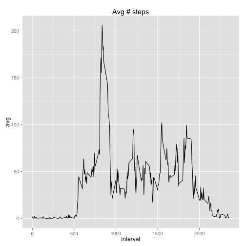
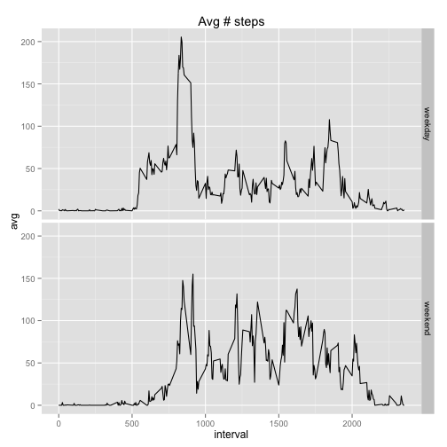

## Loading and preprocessing the data
Load the data:

```r
mydata <- read.csv("activity.csv")
```

## What is mean total number of steps taken per day?
Ignoring missing values.
Histogram of the total number of steps taken each day:

```r
hist(mydata$steps, main=paste("Histogram of # of steps"), xlab = "# of steps")
```

 
Mean and median total number of steps taken per day:

```r
library(plyr)
ddply(mydata, ~date, summarise, mean=mean(steps, na.rm=TRUE), median=median(steps, na.rm=TRUE))
```

```
##          date       mean median
## 1  2012-10-01        NaN     NA
## 2  2012-10-02  0.4375000      0
## 3  2012-10-03 39.4166667      0
## 4  2012-10-04 42.0694444      0
## 5  2012-10-05 46.1597222      0
## 6  2012-10-06 53.5416667      0
## 7  2012-10-07 38.2465278      0
## 8  2012-10-08        NaN     NA
## 9  2012-10-09 44.4826389      0
## 10 2012-10-10 34.3750000      0
## 11 2012-10-11 35.7777778      0
## 12 2012-10-12 60.3541667      0
## 13 2012-10-13 43.1458333      0
## 14 2012-10-14 52.4236111      0
## 15 2012-10-15 35.2048611      0
## 16 2012-10-16 52.3750000      0
## 17 2012-10-17 46.7083333      0
## 18 2012-10-18 34.9166667      0
## 19 2012-10-19 41.0729167      0
## 20 2012-10-20 36.0937500      0
## 21 2012-10-21 30.6284722      0
## 22 2012-10-22 46.7361111      0
## 23 2012-10-23 30.9652778      0
## 24 2012-10-24 29.0104167      0
## 25 2012-10-25  8.6527778      0
## 26 2012-10-26 23.5347222      0
## 27 2012-10-27 35.1354167      0
## 28 2012-10-28 39.7847222      0
## 29 2012-10-29 17.4236111      0
## 30 2012-10-30 34.0937500      0
## 31 2012-10-31 53.5208333      0
## 32 2012-11-01        NaN     NA
## 33 2012-11-02 36.8055556      0
## 34 2012-11-03 36.7048611      0
## 35 2012-11-04        NaN     NA
## 36 2012-11-05 36.2465278      0
## 37 2012-11-06 28.9375000      0
## 38 2012-11-07 44.7326389      0
## 39 2012-11-08 11.1770833      0
## 40 2012-11-09        NaN     NA
## 41 2012-11-10        NaN     NA
## 42 2012-11-11 43.7777778      0
## 43 2012-11-12 37.3784722      0
## 44 2012-11-13 25.4722222      0
## 45 2012-11-14        NaN     NA
## 46 2012-11-15  0.1423611      0
## 47 2012-11-16 18.8923611      0
## 48 2012-11-17 49.7881944      0
## 49 2012-11-18 52.4652778      0
## 50 2012-11-19 30.6979167      0
## 51 2012-11-20 15.5277778      0
## 52 2012-11-21 44.3993056      0
## 53 2012-11-22 70.9270833      0
## 54 2012-11-23 73.5902778      0
## 55 2012-11-24 50.2708333      0
## 56 2012-11-25 41.0902778      0
## 57 2012-11-26 38.7569444      0
## 58 2012-11-27 47.3819444      0
## 59 2012-11-28 35.3576389      0
## 60 2012-11-29 24.4687500      0
## 61 2012-11-30        NaN     NA
```

## What is the average daily activity pattern?
Time series plot of the 5-minute interval (x-axis) and the average number of steps taken, averaged across all days (y-axis):

```r
library(ggplot2)
aggr <- aggregate(mydata$steps, by=list(mydata$interval), FUN=mean, na.rm=TRUE)
names(aggr) <- c("interval","avg")
ggplot(data=aggr, aes(x=interval, y=avg)) + 
  geom_line() +
    ggtitle("Avg # steps")
```

 
Interval with the maximum number of steps across all days:

```r
aggr[which.max(aggr$avg),]
```

```
##     interval      avg
## 104      835 206.1698
```

## Imputing missing values
Imputing missing values.
Total number of missing values in the dataset:

```r
sum(is.na(mydata$steps))
```

```
## [1] 2304
```
Replace missing values with median for given interval across all days:

```r
mydata2 <- ddply(mydata, 
      .(interval), 
      transform, 
      steps=ifelse(is.na(steps), median(steps, na.rm=TRUE), steps))
```

## What is mean total number of steps taken per day?
Ignoring missing values.
Histogram of the total number of steps taken each day:

```r
hist(mydata2$steps, main=paste("Histogram of # of steps"), xlab = "# of steps")
```

 
Mean and median total number of steps taken per day:

```r
library(plyr)
ddply(mydata2, ~date, summarise, mean=mean(steps, na.rm=TRUE), median=median(steps, na.rm=TRUE))
```

```
##          date       mean median
## 1  2012-10-01  3.9618056      0
## 2  2012-10-02  0.4375000      0
## 3  2012-10-03 39.4166667      0
## 4  2012-10-04 42.0694444      0
## 5  2012-10-05 46.1597222      0
## 6  2012-10-06 53.5416667      0
## 7  2012-10-07 38.2465278      0
## 8  2012-10-08  3.9618056      0
## 9  2012-10-09 44.4826389      0
## 10 2012-10-10 34.3750000      0
## 11 2012-10-11 35.7777778      0
## 12 2012-10-12 60.3541667      0
## 13 2012-10-13 43.1458333      0
## 14 2012-10-14 52.4236111      0
## 15 2012-10-15 35.2048611      0
## 16 2012-10-16 52.3750000      0
## 17 2012-10-17 46.7083333      0
## 18 2012-10-18 34.9166667      0
## 19 2012-10-19 41.0729167      0
## 20 2012-10-20 36.0937500      0
## 21 2012-10-21 30.6284722      0
## 22 2012-10-22 46.7361111      0
## 23 2012-10-23 30.9652778      0
## 24 2012-10-24 29.0104167      0
## 25 2012-10-25  8.6527778      0
## 26 2012-10-26 23.5347222      0
## 27 2012-10-27 35.1354167      0
## 28 2012-10-28 39.7847222      0
## 29 2012-10-29 17.4236111      0
## 30 2012-10-30 34.0937500      0
## 31 2012-10-31 53.5208333      0
## 32 2012-11-01  3.9618056      0
## 33 2012-11-02 36.8055556      0
## 34 2012-11-03 36.7048611      0
## 35 2012-11-04  3.9618056      0
## 36 2012-11-05 36.2465278      0
## 37 2012-11-06 28.9375000      0
## 38 2012-11-07 44.7326389      0
## 39 2012-11-08 11.1770833      0
## 40 2012-11-09  3.9618056      0
## 41 2012-11-10  3.9618056      0
## 42 2012-11-11 43.7777778      0
## 43 2012-11-12 37.3784722      0
## 44 2012-11-13 25.4722222      0
## 45 2012-11-14  3.9618056      0
## 46 2012-11-15  0.1423611      0
## 47 2012-11-16 18.8923611      0
## 48 2012-11-17 49.7881944      0
## 49 2012-11-18 52.4652778      0
## 50 2012-11-19 30.6979167      0
## 51 2012-11-20 15.5277778      0
## 52 2012-11-21 44.3993056      0
## 53 2012-11-22 70.9270833      0
## 54 2012-11-23 73.5902778      0
## 55 2012-11-24 50.2708333      0
## 56 2012-11-25 41.0902778      0
## 57 2012-11-26 38.7569444      0
## 58 2012-11-27 47.3819444      0
## 59 2012-11-28 35.3576389      0
## 60 2012-11-29 24.4687500      0
## 61 2012-11-30  3.9618056      0
```

## Are there differences in activity patterns between weekdays and weekends?
Time series plot of the 5-minute interval (x-axis) and the average number of steps taken, averaged across all days (y-axis), for weekdays vs weekends: 

```r
mydata2$weekday <- weekdays(as.Date(mydata2$date))
mydata2$weekday[mydata2$weekday=="Saturday" | mydata2$weekday=="Sunday"] <- "weekend"
mydata2$weekday[mydata2$weekday!="weekend"] <- "weekday"
mydata2$weekday <- factor(mydata2$weekday, labels=c("weekday","weekend"))

aggr2 <- aggregate(mydata2$steps, by=list(mydata2$interval,mydata2$weekday), FUN=mean)
names(aggr2) <- c("interval","weekday","avg")
ggplot(data=aggr2, aes(x=interval, y=avg)) + 
     geom_line() +
     ggtitle("Avg # steps") +
     facet_grid(weekday ~ .)
```

 

